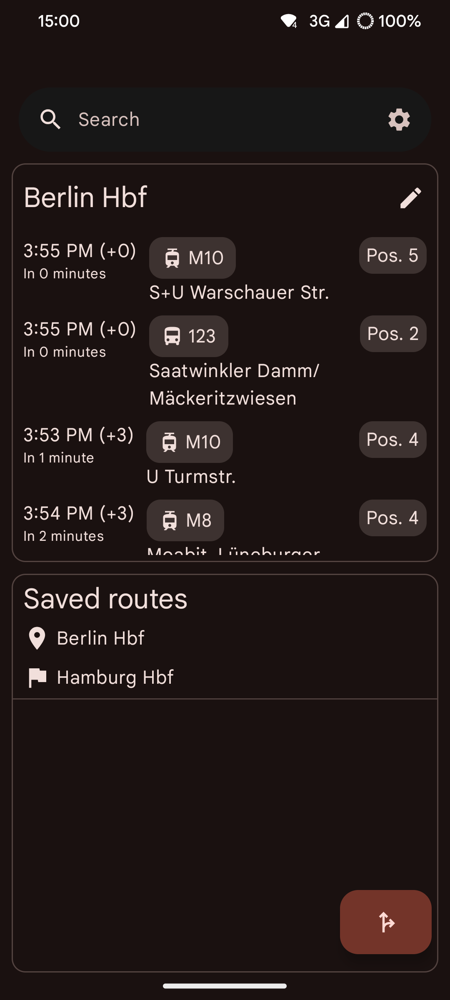
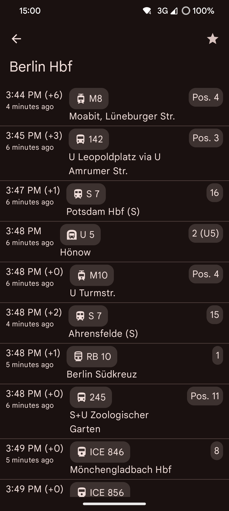
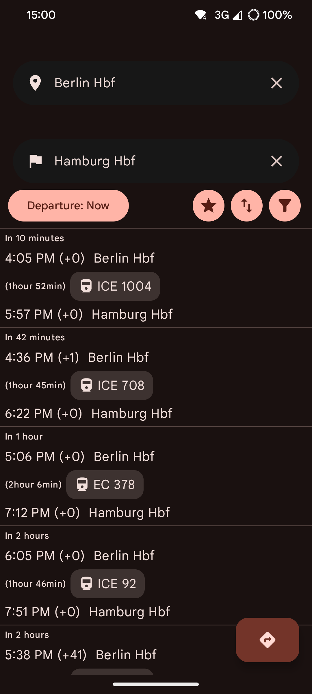
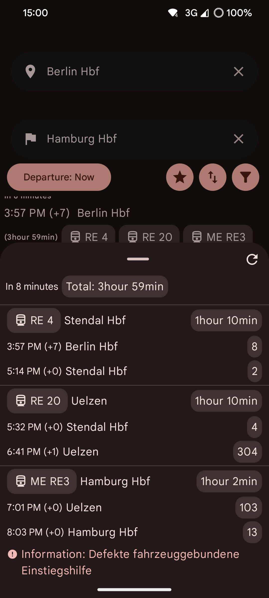

<!-- ---------- Header ---------- -->

  
  <h1>Transport You</h1>

Privacy focused public transport app built with MD3.

<!-- ---------- Badges ---------- -->
  

    
    
    
    
    
     

> [!NOTE]
> The data is obtained via the <a href='https://github.com/schildbach/public-transport-enabler'>public-transport-enabler</a> library, we do **not** guarantee for its correctness.
<!-- ---------- Description ---------- -->
## Features

- [x] Querying trips and train stations
- [x] Dashboard and widget of current departures at a train station
- [x] Bookmarking locations and trips
- [x] Support for many public transport providers
- [x] Viewing trips on a map via [MapLibre](https://maplibre.org/) and [OpenFreeMap](https://openfreemap.org/)

<!-- ---------- Download ---------- -->
## Download
  

<!-- ---------- Screenshots ---------- -->
## Screenshots

  
  
  
  

<!-- ---------- Contribution ---------- -->
## Feedback and contributions
***All contributions are very welcome!***

* Feel free to join the [Matrix room](https://matrix.to/#/#you-apps:matrix.org) for discussions about the app.
* Bug reports and feature requests can be submitted [here](https://github.com/you-apps/TransportYou/issues) (please make sure to fill out all the requested information properly!).
* If you are a developer and wish to contribute to the app, please **fork** the project and submit a [**pull request**](https://help.github.com/articles/about-pull-requests/).

## Translation

## License

Transport You is licensed under the [**GNU General Public License**](https://www.gnu.org/licenses/gpl.html): You can use, study and share it as you want.
